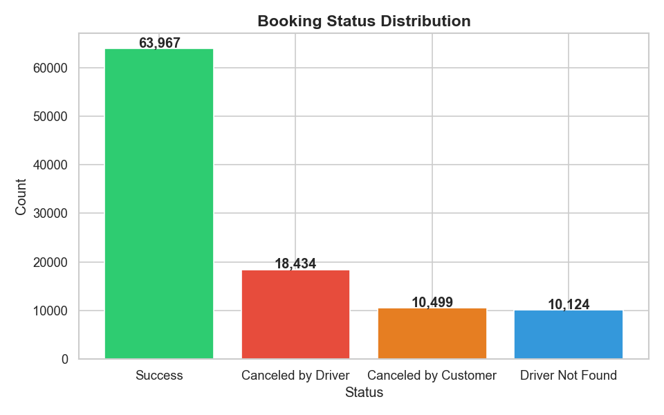
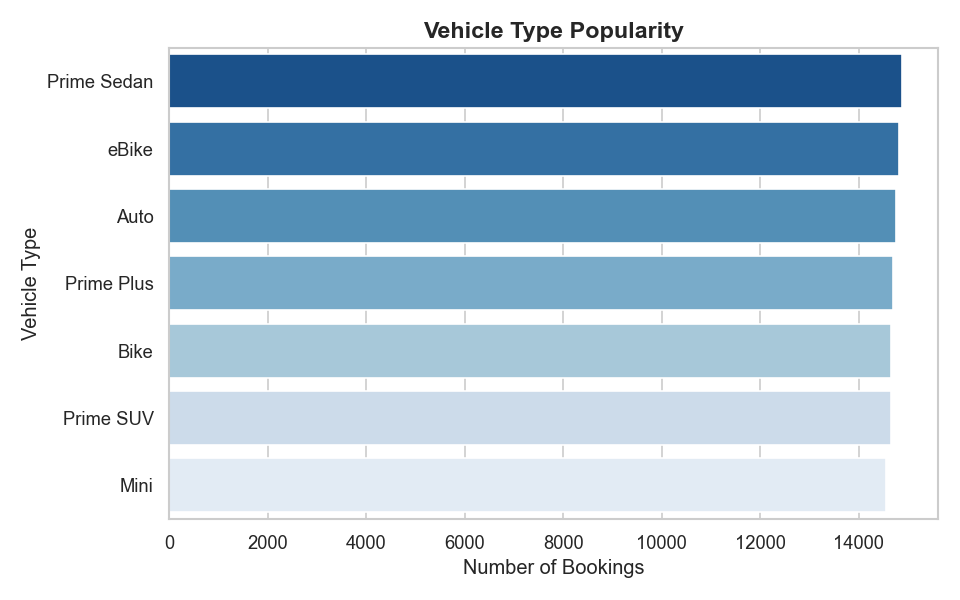
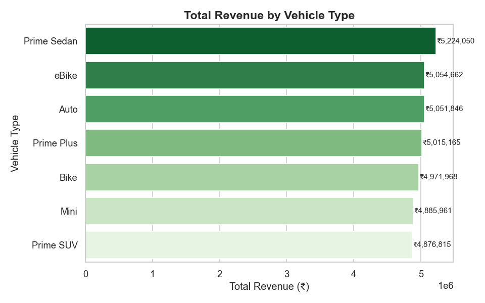
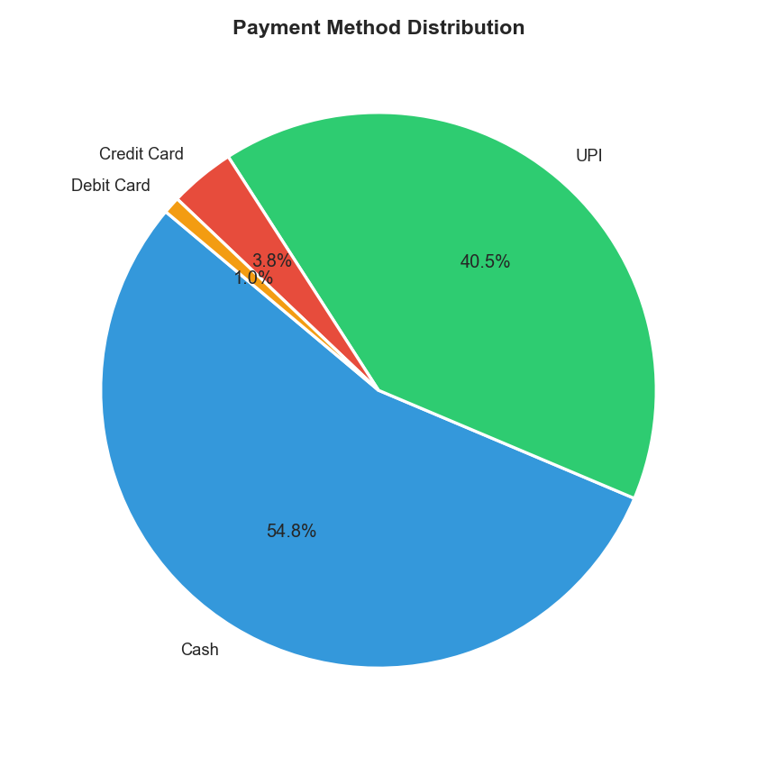
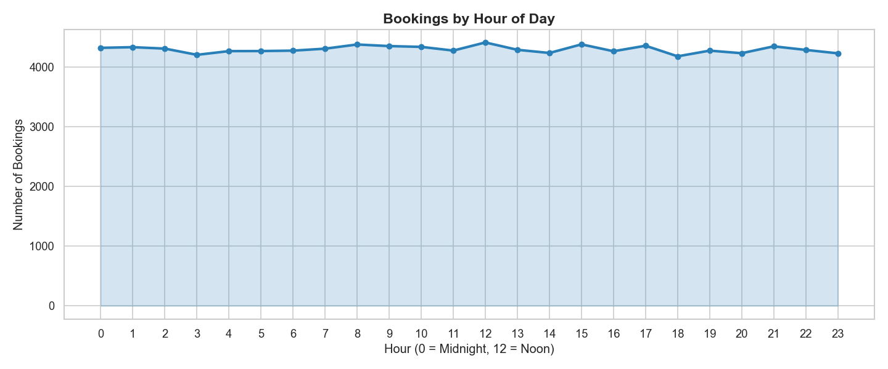
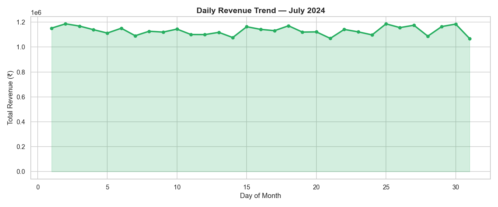
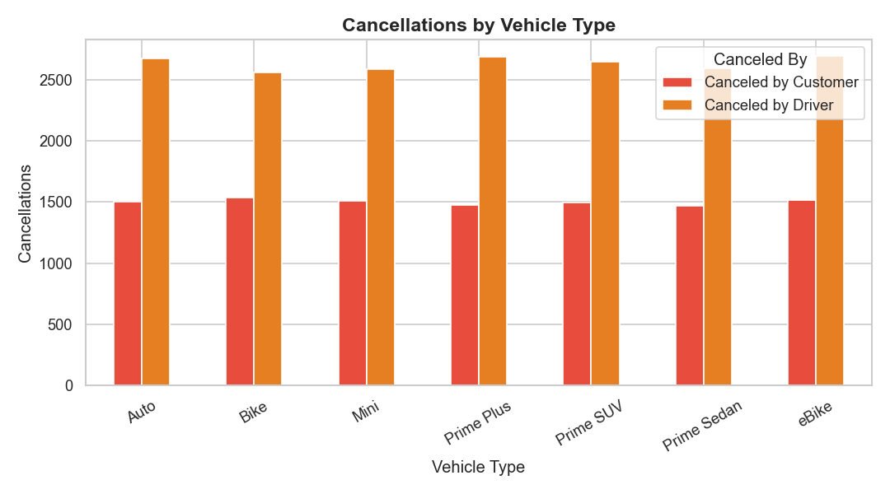
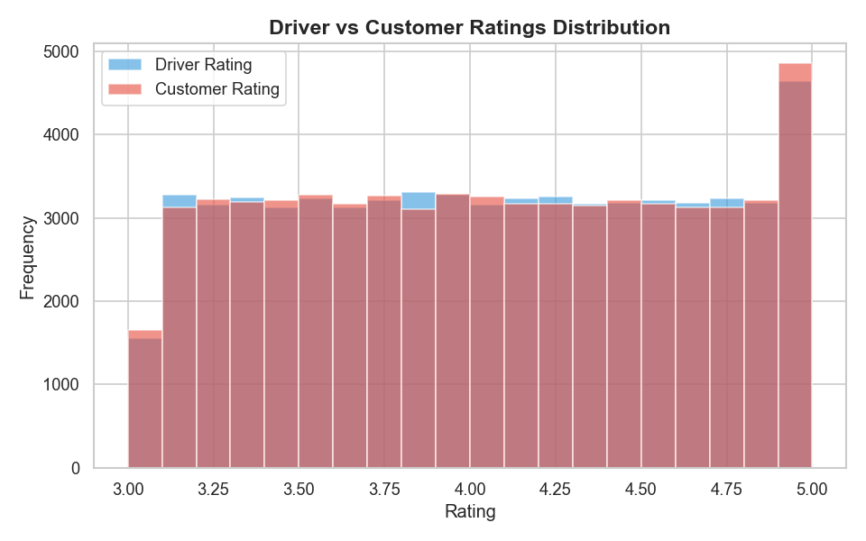

# 🚕 Ola Ride Booking Data Insights & Business Intelligence Dashboard

A complete end-to-end data analytics project on Ola ride booking data — covering raw data ingestion, Python-based cleaning, SQLite-based SQL analysis, Python visualisations, and an interactive Power BI dashboard.

---

## 📌 Project Overview

This project analyses ride booking data for **July 2024** across vehicle types, pickup/drop locations, payment methods, and customer behaviour. The goal was to uncover operational trends, identify cancellation patterns, and present business insights through a professional BI dashboard.

**Dataset:** 103,024 bookings | 23 columns | 7 vehicle types | 1 month

---

## 🛠️ Tools & Technologies

| Layer | Tool |
|---|---|
| Data Cleaning | Python (Pandas) |
| Exploratory Analysis | Python (Pandas) |
| Database & SQL | SQLite (via Python) |
| Visualisation (Python) | Matplotlib, Seaborn |
| Visualisation (BI) | Power BI Desktop |
| IDE | VS Code / Jupyter Notebook |

---

## 📁 Project Structure

```text
Ola-Ride-Analysis/
│
├── images/
│   │
│   ├── Dashboard/
│   │   ├── executive_dashboard.jpg
│   │   ├── Revenue_Analysis.jpg
│   │   ├── Ride_patterns.jpg
│   │   ├── Cancellation.jpg
│   │   └── Ratings.jpg
│   │
│   ├── chart1_booking_status.png
│   ├── chart2_vehicle_type.png
│   ├── chart3_revenue_by_vehicle.png
│   ├── chart4_payment_method.png
│   ├── chart5_hourly_bookings.png
│   ├── chart6_daily_revenue.png
│   ├── chart7_cancellations.png
│   └── chart8_ratings.png
│
├── bookings.xlsx              # Original raw dataset
├── cleaned_bookings.csv       # Final cleaned dataset
│
├── understand_data.py         # Initial data exploration
├── clean_data.py              # Data cleaning pipeline
├── eda.py                     # Exploratory data analysis
├── sql_analysis.py            # SQL queries via SQLite
├── charts.py                  # Python visualisations
│
├── Ola_Analysis.pbix          # Power BI dashboard file
├── requirements.txt
└── README.md
```

---

## 🔄 Project Workflow

```text
Raw Excel → Python Cleaning → cleaned_bookings.csv → SQL Analysis → Python Charts → Power BI Dashboard
```

---

## 📊 Data Analysis Workflow

### Step 1 — Data Understanding (`understand_data.py`)
- Explored dataset structure, columns, and statistics
- Identified missing values and inconsistent records
- Checked data types and booking distributions
- Raw dataset size: **103,024 rows × 24 columns**

### Step 2 — Data Cleaning (`clean_data.py`)
- Removed fully empty columns
- Handled null values logically
- Converted date columns into datetime format
- Created engineered features:
  - `Day`
  - `DayOfWeek`
  - `Hour`
  - `Time_Period`
- Final cleaned dataset:
  - **103,024 rows × 23 columns**
  - Zero unresolved null values

### Step 3 — Exploratory Data Analysis (`eda.py`)
Performed detailed analysis on:
- Booking success vs cancellation
- Vehicle popularity
- Revenue distribution
- Payment methods
- Peak booking hours
- Ride distance patterns
- Ratings analysis
- Cancellation behaviour

### Step 4 — SQL Analysis (`sql_analysis.py`)
Loaded cleaned dataset into SQLite and executed analytical SQL queries for:
- Revenue analysis
- Vehicle performance
- Booking status breakdown
- Top pickup/drop locations
- Cancellation patterns
- Daily trends
- Ratings analysis

### Step 5 — Python Visualisations (`charts.py`)

Generated 8 charts using Matplotlib and Seaborn:

| Chart | Type | Insight |
|---|---|---|
| Booking Status Distribution | Bar Chart | Success vs cancellation split |
| Vehicle Type Popularity | Horizontal Bar | Most booked vehicles |
| Revenue by Vehicle Type | Horizontal Bar | Revenue contribution |
| Payment Method Distribution | Pie Chart | Customer payment preferences |
| Bookings by Hour | Area + Line Chart | Hourly demand pattern |
| Daily Revenue Trend | Area + Line Chart | Revenue fluctuations |
| Cancellations by Vehicle | Grouped Bar | Driver vs customer cancellations |
| Ratings Distribution | Histogram | Driver and customer ratings |

### Step 6 — Power BI Dashboard (`Ola_Analysis.pbix`)

Created a professional 5-page interactive dashboard with slicers and KPIs.

| Dashboard Page | Features |
|---|---|
| Executive Dashboard | KPIs, booking status, vehicle trends |
| Revenue Analysis | Revenue trends, top routes |
| Ride Patterns | Time analysis, booking trends |
| Cancellations | Cancellation insights and reasons |
| Ratings | Driver & customer rating analysis |

---

## 📊 Key Findings

- **Total Bookings:** 103,024
- **Total Revenue:** ₹35M
- **Success Rate:** 62.1%
- **Average Ride Distance:** 22.85 km
- **Average Booking Value:** ₹548.75
- **Prime Sedan** generated the highest revenue
- Driver cancellations are significantly higher than customer cancellations
- Cash is the most preferred payment method
- Bookings are relatively evenly distributed across all hours
- Ratings remain mostly between 3.0–5.0

---

# 📸 Python Visualisations

## Booking Status Distribution


---

## Vehicle Type Popularity


---

## Revenue by Vehicle Type


---

## Payment Method Distribution


---

## Hourly Booking Trend


---

## Daily Revenue Trend


---

## Cancellations by Vehicle Type


---

## Ratings Distribution


---

# 📊 Power BI Dashboard Preview

## Executive Dashboard


---

## Revenue Analysis Dashboard


---

## Ride Patterns Dashboard


---

## Cancellation Dashboard


---

## Ratings Dashboard


---

## ▶️ How to Run

### 1. Clone Repository

```bash
git clone https://github.com/your-username/Ola-Ride-Analysis.git
cd Ola-Ride-Analysis
```

### 2. Install Dependencies

```bash
pip install -r requirements.txt
```

### 3. Run Python Files

```bash
python understand_data.py
python clean_data.py
python eda.py
python sql_analysis.py
python charts.py
```

### 4. Open Power BI Dashboard

Open:

```text
Ola_Analysis.pbix
```

in Power BI Desktop.

---

# ⭐ Project Highlights

✅ End-to-end data analytics pipeline  
✅ Python + SQL + Power BI integration  
✅ Business-focused KPI analysis  
✅ Professional visualisations  
✅ Interactive BI dashboard  
✅ Real-world ride booking analytics use case
